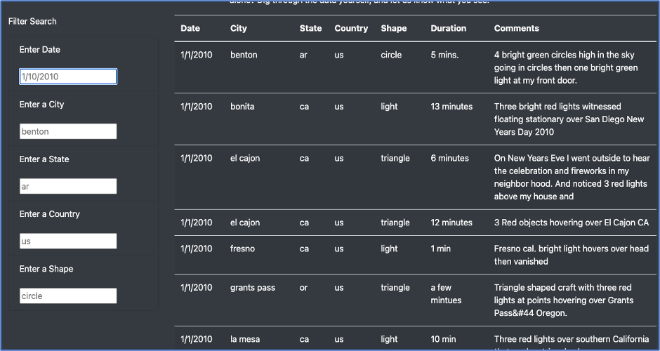
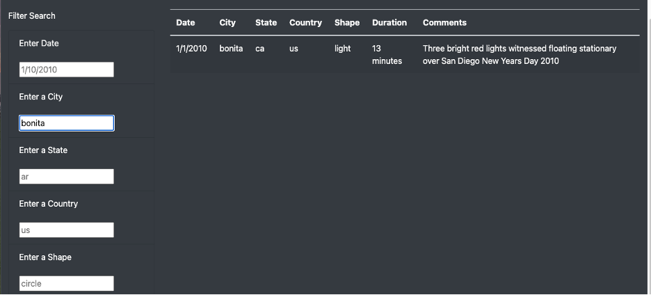
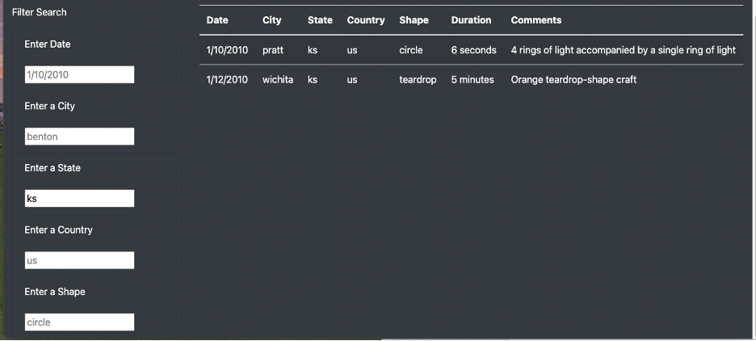
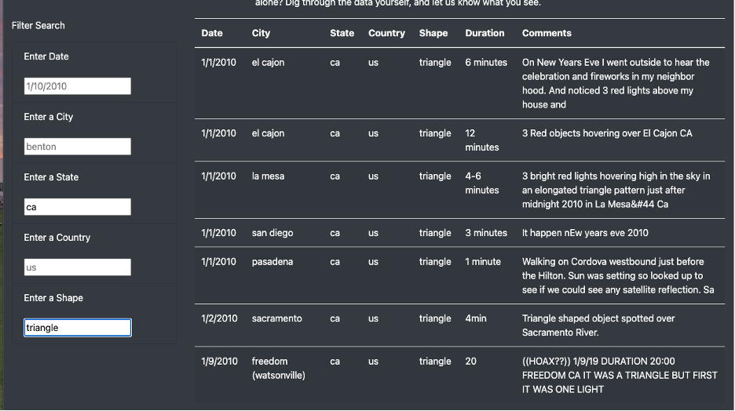
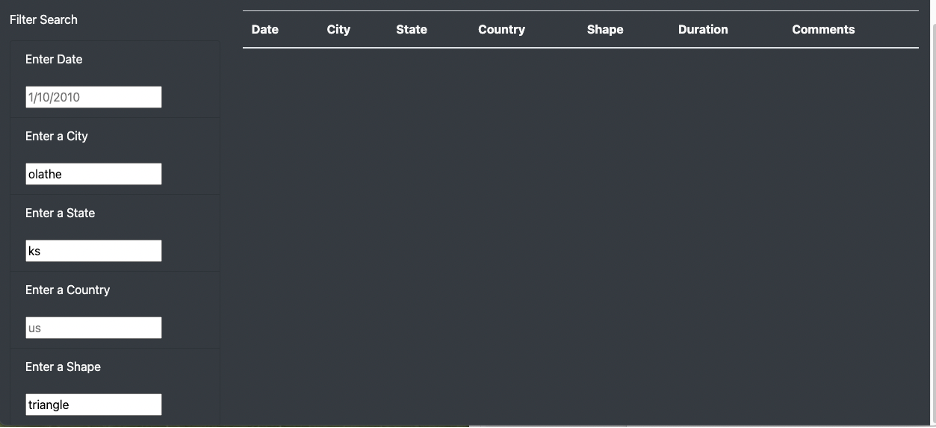

# UFOs

The goal of this challenge was to present data in a visually appealing manner and make it interactive. Thus, a dynamic web page was created by inserting JavaScript into an HTML page. A table was built to hold data for UFO sighting information. Filters were added to refine searches on five variables: date, city, state, country and shape.  

## Results

The webpage was designed to include five filters for the UFO sighting information. The user can filter according to date of sighting, city or state of sighting, the country of the sighting, or the shape or any combination of filters. The filter boxes have placeholders so the user can see how the query is to be entered. 

<figcaption align = "center"><b>Search Filters</b><figcaption>
  

For example, the user can input a specific city such as Bonita. The result is displayed in the image below.

<figcaption align = "center"><b>City Filter</b><figcaption>

  
Alternatively, a user could also input a state such as Kansas. The result is displayed in the image below.

<figcaption align = "center"><b>State Filter</b><figcaption>
  

  
 If a user wants to use a combination of filters, information could be entered into the boxes such as California for state and triangle for shape. The result is displayed in the image below. 

<figcaption align = "center"><b>More Than One Filter</b><figcaption>

Lastly, if a user attempts to filter for a value that is not included in the data set, the following image is presented. 

<figcaption align = "center"><b>Filter with Empty Results</b><figcaption>

## Summary
  
In summary, the overall design and layout of the page and the filters included for the data searches is aesthetically pleasing. However, one drawback of this design is if the user does not realize all the different shapes that are possible, they might unknowingly miss data they would potentially find significant.  To remedy this drawback, the code could be refactored to include a dropdown menu that the user could select the shape rather than having to enter the value into a box. Additionally, the specific date of a sighting might not be known thus adding a filter that would include date ranges would be beneficial as well. 
